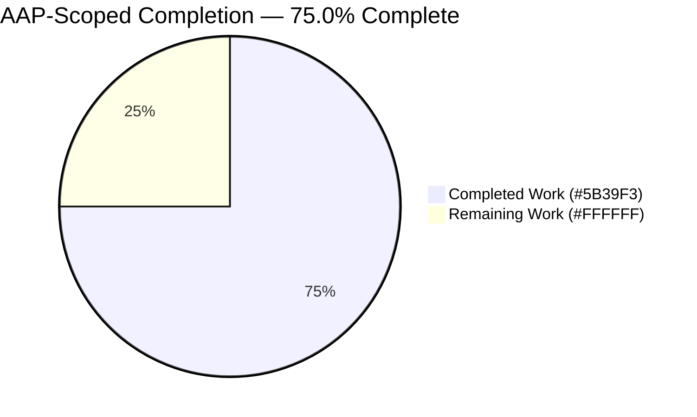
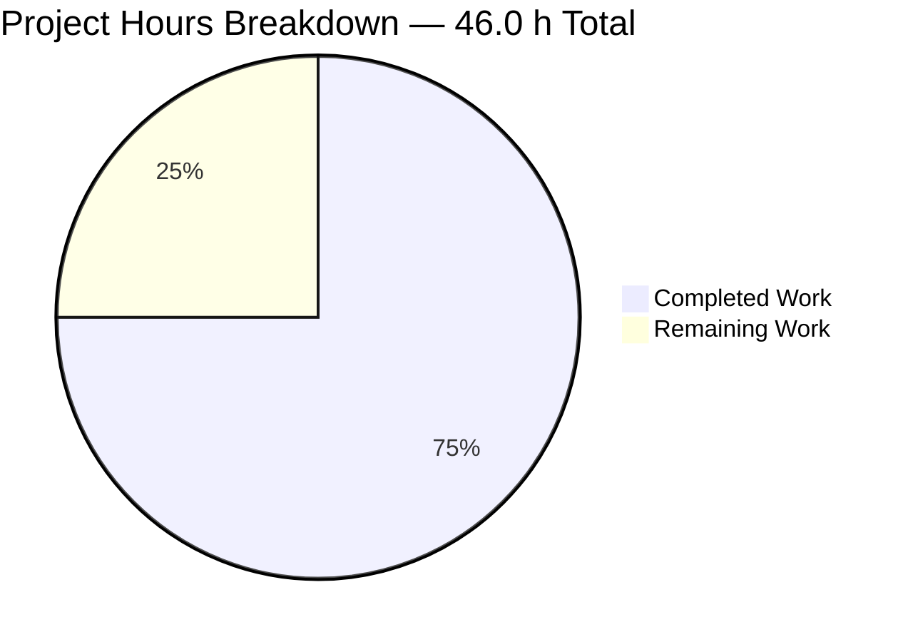
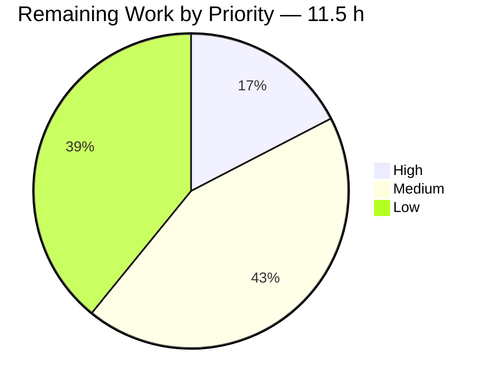
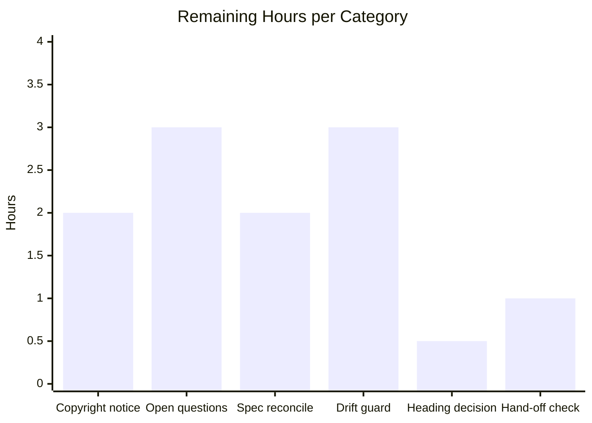
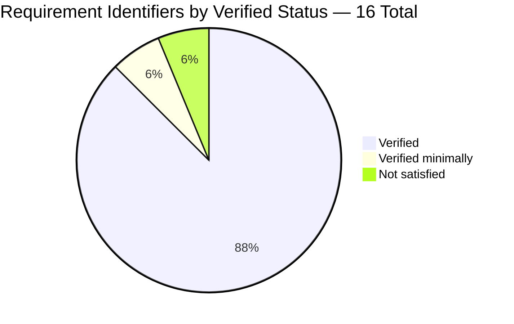

# 1. Executive Summary

## 1.1 Project Overview

BlitzyRepo1 now has its first requirements documentation. The repository is a 14-line zero-dependency Node.js HTTP service (`server.js`) answering every request on `127.0.0.1:3000` with one fixed plain-text greeting, plus an Apache-2.0 licence and a one-line README. It held no requirements document. The delivered artifact, `docs/user-stories.md`, reverse-engineers the as-built requirement set into five epics and seventeen user stories in canonical form, each with bulleted pass/fail criteria cited into the implementing source and traced to the published requirement identifiers. Its readers are this codebase's maintainers, operators and redistributors.

## 1.2 Completion Status



| Metric | Value |
|---|---|
| **Total Hours** | **46.0 h** |
| Completed Hours (AI) | 34.5 h |
| Completed Hours (Manual) | 0.0 h |
| **Completed Hours (AI + Manual)** | **34.5 h** |
| **Remaining Hours** | **11.5 h** |
| **Percent Complete** | **75.0 %** |

`34.5 ÷ 46.0 × 100 = 75.0 %`. Every scoped deliverable is complete; the remaining 11.5 h is owner decisions and hardening (Section 2.2). Completed: Dark Blue `#5B39F3` · Remaining: White `#FFFFFF`.

## 1.3 Key Accomplishments

- ✅ `docs/user-stories.md` published — 5 epics, 17 stories, 50 bulleted criteria, 380 lines
- ✅ All 16 published requirement identifiers covered by at least one criterion
- ✅ Traceability bidirectional and consistent across all 16 rows
- ✅ All 80 source citations resolve inside real file bounds
- ✅ Every asserted runtime value measured against the running service
- ✅ `server.js` and `LICENSE` byte-identical to the documented baseline
- ✅ Artifact linked from the repository's only entry point (`README.md:5`)
- ✅ The one unmet requirement recorded as unmet (US-017)

## 1.4 Critical Unresolved Issues

Three items are open: **1 of 16** traced requirements unsatisfied, **4 of 4** open questions awaiting a product-owner answer, and **0 of 4** tracked files covered by any automated check.

| Issue | Impact | Owner | ETA |
|---|---|---|---|
| No copyright holder is asserted anywhere — no per-file header, no README copyright line, no `NOTICE` file (`F-005-RQ-003` / US-017) | A redistributor cannot carry the attribution notice Apache-2.0 clause 4 contemplates. Cannot be closed without an owner decision the repository does not hold; see Section 5.2 | Repository owner / legal | 2.0 h once owner and year are decided |
| Four product-owner questions unanswered: the product name in the greeting literal has no capability behind it; copyright owner and year; supported Node.js version range; whether the loopback-only bind is intentional | Consumers have no compatibility statement and no deployment-intent statement. All four are recorded as non-blocking in the artifact and none prevented delivery | Product owner | 3.0 h to record answers (copyright covered above) |
| No test runner, linter or Markdown validator exists in the repository, so nothing re-checks the artifact's 80 source citations or 50 criteria after a future source edit | Requirements documentation can silently go stale against the code it describes. Pre-existing, and adding tooling was outside the delivered scope | Maintainer | 3.0 h |

## 1.5 Access Issues

**No access issues identified.** Validated here: `origin` is reachable, `git ls-remote --heads origin` exits 0, and the remote branch head matches the local head. The project has zero dependencies and needs no credential, environment variable or secret.

## 1.6 Recommended Next Steps

1. **[High]** Decide the copyright owner and year, then attach a notice following the boilerplate at `LICENSE:178-189` — never by editing the licence text. Closes the one unsatisfied requirement.
2. **[Medium]** Answer the three remaining open questions, in particular declaring a supported Node.js version range.
3. **[Medium]** Reconcile the superseded specification statements and ratify the two narrowed requirement readings (Section 5.2).
4. **[Low]** Add a drift guard re-validating the artifact's citations and asserted values against `server.js`.
5. **[Low]** Confirm the artifact renders in the hosting platform and the README link resolves there.

# 2. Project Hours Breakdown

## 2.1 Completed Work Detail

| Component | Hours | Description |
|---|---|---|
| Requirements discovery and story derivation | 6.0 | Full walk of the 4-file tree; all 14 lines of `server.js` and all 201 lines of `LICENSE` read as the sole sources of truth; the 16 published requirement identifiers mapped to code locations; 17 distinct actor outcomes derived and checked for exhaustive coverage; criteria format, story-quality filter and traceability structure settled |
| Artifact framing: provenance, conventions, personas, epic index | 4.0 | Provenance naming the documented baseline commit with the originating request quoted verbatim; a 13-bullet conventions note fixing the story shape, four controlled vocabularies, the criterion-versus-note rule, the absence-evidence form and three stated-once readings; four personas with their derivations; a four-column epic index with the feature-dependency statement (`docs/user-stories.md:1-45`) |
| Seventeen user stories with fifty bulleted acceptance criteria | 10.0 | US-001–US-017 across epics E-01–E-05, each with a canonical one-sentence statement, a six-field metadata line, its acceptance criteria as one pass/fail bullet each, and a non-normative note block that separates runtime, host and client behaviour from what the application itself does (`docs/user-stories.md:47-302`) |
| Bidirectional traceability, identifier handles, open questions, exclusion register | 4.0 | A 16-row backward coverage table carrying source locations and inherited statuses; a forward `Covers` field on every story; 19 assumption and constraint handles placed at their assigned locations; four non-blocking open questions; an 11-row register naming 25 absent capability domains so their absence is explicit (`docs/user-stories.md:304-380`) |
| README discoverability seam | 0.5 | One appended Documentation section with a relative link to the artifact, the baseline heading preserved byte-for-byte and the trailing newline the file previously lacked inserted (`README.md:1-7`) |
| Runtime measurement of the documented HTTP contract | 4.0 | Status, header, 34-byte body, startup line, method and path invariance, `HEAD` suppression, loopback confinement and the port-conflict failure path all measured against the running service, so every criterion states a value the code actually produces rather than one inferred from reading it |
| Structural and runtime verification gate | 6.0 | 92 structural checks across change surface, README seam, file conventions, document structure, traceability, evidence citations, prohibited content and value fidelity; 38 runtime probes; zero-install execution proved from a clean copy of the tracked tree; the response surface driven in a real browser |
| **Total** | **34.5** | Matches Completed Hours in Section 1.2 |

## 2.2 Remaining Work Detail

| Category | Hours | Priority |
|---|---|---|
| Copyright holder decision and repository notice — decide owner and year, attach a per-file header or `NOTICE` following the appendix boilerplate, then update the story status and its coverage row (closes `F-005-RQ-003`) | 2.0 | High |
| Product-owner answers to the three remaining open questions — product intent behind the greeting's product name, supported Node.js version range, and whether the loopback-only bind is intentional | 3.0 | Medium |
| Reconcile the requirement specification's superseded current-state statements and ratify the two narrowed requirement readings | 2.0 | Medium |
| Documentation drift guard — a check that re-validates the artifact's source citations, asserted values and runtime observables against `server.js` | 3.0 | Low |
| README Documentation heading-level decision | 0.5 | Low |
| Hosting-platform render and link-resolution hand-off check | 1.0 | Low |
| **Total** | **11.5** | Matches Remaining Hours in Section 1.2 and the Section 7 pie chart |

## 2.3 Hours Reconciliation

| Check | Expected | Actual | Result |
|---|---|---|---|
| Section 2.1 total | 34.5 h | 34.5 h | ✅ |
| Section 2.2 total | 11.5 h | 11.5 h | ✅ |
| Section 2.1 + Section 2.2 = Total Hours (Section 1.2) | 46.0 h | 46.0 h | ✅ |
| Section 2.2 total = Remaining Hours (Section 1.2) | 11.5 h | 11.5 h | ✅ |
| Section 2.2 total = Section 7 pie "Remaining Work" | 11.5 h | 11.5 h | ✅ |
| Completion percentage `34.5 ÷ 46.0 × 100` | 75.0 % | 75.0 % | ✅ |

All 34.5 completed hours are autonomous work; no manual engineering hours were contributed. Confidence is high on the six completed components measured against the repository and high on the three highest-value remaining items; the open-questions item carries medium confidence because one of the questions may open product scope beyond documentation.

# 3. Test Results

This repository ships no automated test suite, and the delivered scope deliberately did not add one. Verification is therefore executable rather than test-framework based: every row below was run against this branch and its result observed directly.

| Area / Category | Framework | Tests | Passed | Failed | Coverage | What This Proves |
|---|---|---|---|---|---|---|
| Repository automated test suite | Node 22 built-in runner (`node --test`) | 0 | 0 | 0 | None — no test file exists in the tree | That the repository ships zero automated tests: the runner discovers none and exits 0 |
| Source syntax validation | `node --check` | 1 | 1 | 0 | `server.js`, 14 of 14 lines | The only executable file in the repository parses cleanly under the installed runtime |
| Change surface, scope containment and README seam | Executable check suite (git + Python) | 16 | 16 | 0 | All 4 tracked paths, 11 forbidden paths asserted absent, `README.md` 7 of 7 lines | That the change is exactly one added file and one modified file; that `server.js` and `LICENSE` are blob-identical to the documented baseline; that no manifest, lockfile, test or tooling file entered the tree; and that the README's baseline heading survives byte-for-byte with its single relative link resolving to a real file |
| Artifact file conventions and document structure | Executable check suite | 30 | 30 | 0 | `docs/user-stories.md`, 380 of 380 lines | That the artifact is LF-only with no tabs, trailing whitespace or stray blank runs, and that its 5 epics, 17 stories, 50 criteria bullets, 4 personas and 4 well-formed tables are all present with no heading-level jump |
| Requirement traceability and evidence citations | Executable check suite | 22 | 22 | 0 | 16 of 16 requirement identifiers; 80 of 80 source citations; 19 of 19 identifier handles | That no published requirement is left uncovered, that forward and backward traceability agree on every row, that every citation resolves inside real file bounds, and that the inherited status distribution is exactly 15 verified / 1 minimally verified / 1 unsatisfied |
| Prohibited content and value fidelity | Executable check suite | 24 | 24 | 0 | Whole artifact, with `server.js` and `LICENSE` as adjudicating authorities | That no placeholder, invented requirement total, schedule estimate or non-loopback address appears, and that every quoted value — the 34-byte greeting, the startup line, the endpoint, the 201-line/11,357-byte licence, the intact appendix placeholder — matches the committed source exactly |
| HTTP contract runtime probes | `curl` / `ss` / `lsof` probes against the running service | 38 | 38 | 0 | The request-handler path, start-up path and port-conflict failure path | That the documented contract holds live: `200`, `text/plain` and the same 34-byte body for `GET`, `POST`, `PUT`, `DELETE`, `PATCH`, `OPTIONS`, arbitrary paths and queries and unauthenticated `DELETE /admin`; `HEAD` suppressed; loopback-only binding; stdout stable at one line; and a port conflict exiting 1 with no readiness line |
| **Total** | — | **131** | **131** | **0** | — | — |

### Not Covered

These capabilities were delivered or documented but are exercised by **no test in the repository**. A human should confirm them before release:

- **Both delivered files.** `docs/user-stories.md` and `README.md` are Markdown, and the repository contains no test runner, linter or Markdown validator to exercise them. The 131 checks above are not retained in the repository, so nothing inside it re-runs them.
- **Prose durability against source change.** No check asserts that the artifact's 80 source citations and 50 criteria remain true if `server.js` is edited. This is the single largest coverage gap and is costed in Section 2.2.
- **Rendered presentation.** Markdown rendering in the hosting platform's web view, and resolution of the `README.md` relative link in that view, were not exercised — the repository serves no documentation and defines no user interface.
- **Runtime breadth beyond the probes above.** Sustained load, sustained uptime, non-Linux hosts, and Node.js releases other than the one installed are untested; the repository declares no supported version range against which such a matrix could be defined.
- **Judgement-based authoring rules.** Whether each story is genuinely valuable, small and independently checkable, and whether the four personas are the right abstraction, are human-review questions no executable check can settle.

# 4. Runtime Validation and UI Verification

The service was started detached on a confirmed-free port, driven with shell probes and a real headless browser, then stopped by its captured process id, leaving the port released. Everything below was observed in this session.

- ✅ **Service start-up** — `node server.js` from the repository root reaches readiness with no error and prints exactly one 41-byte line, `Server running at http://127.0.0.1:3000/`, with nothing on stderr.
- ✅ **Endpoint and interface confinement** — exactly one IPv4 listener at `127.0.0.1:3000`; no wildcard and no IPv6 listener. A probe to this host's non-loopback address returned no connection.
- ✅ **Uniform response contract** — `GET`, `POST`, `PUT`, `DELETE`, `PATCH` and `OPTIONS`, against `/`, an arbitrary path with a query string, `/favicon.ico` and an unauthenticated `DELETE /admin`, every one returned `200`, `Content-Type: text/plain` and the identical 34-byte body (sha256 prefix `6bdf54b21030`). A query value sent in was not echoed back.
- ✅ **Protocol-layer behaviour** — `HEAD` returned `200` with no body and no `Content-Length`, matching what the artifact records as runtime rather than application behaviour.
- ✅ **Browser rendering** — headless Chrome 151 rendered the response as literal plain text: 5 DOM elements, all browser-generated scaffolding, a single `PRE` holding the greeting, zero `<script>` elements, `doctype` null and zero console messages of any severity.
- ✅ **Hostile-input handling in the browser** — navigating to a URL-encoded `<script>alert(1)</script>` path returned the same plain-text body: no script executed, no dialog was raised (verified with a dialog trap proven functional by a control call), and all six URL-reflection probes came back negative.
- ✅ **Start-up telemetry stability** — stdout remained exactly one line and stderr exactly zero bytes after every request in the matrix; the request handler writes no log.
- ✅ **Zero-install execution** — a clean copy of the tracked tree (4 files, all byte-identical) started and served the identical response with no package installation and no build step, and with no `node_modules` present.
- ⚠ **Port-conflict failure path** — exercised deliberately. A second instance exits `1` immediately with `Error: listen EADDRINUSE: address already in use 127.0.0.1:3000` on stderr, prints no readiness line, and has no retry or fallback. This is the documented behaviour, not a defect, and an absent readiness line is the reliable signal that start-up failed.
- ❌ **Not exercised at runtime: the documentation itself.** Neither delivered file is served by the application or rendered by anything in the repository, so no runtime path touches them. Equally, there is no authentication, authorization or session flow to exercise anywhere in this codebase — the application identifies no caller and defines no roles, so no login journey exists to verify.

# 5. Compliance and Quality Review

## 5.1 Compliance Matrix

Verified status of each scoped deliverable as it stands now.

| # | Deliverable | Benchmark | Status | Evidence |
|---|---|---|---|---|
| 1 | Requirements artifact created at the specified path | Exists, complete, correctly ordered sections | ✅ PASS | `docs/user-stories.md`, 380 lines / 36,231 bytes, 9 sections in the required order |
| 2 | Seventeen detailed user stories in canonical form | 17 unique, contiguous stories each with a one-sentence statement and a six-field metadata line | ✅ PASS | 17 story headings US-001–US-017; 17 statements; 17 metadata lines |
| 3 | Acceptance criteria as bulleted pass/fail conditions | Bullets only — no Gherkin, table rows or paragraphs; 1–6 per story | ✅ PASS | 50 `-` bullets, distribution 3,3,2,2,5,3,2,3,5,2,5,4,2,3,4,1,1; maximum 5 |
| 4 | Every published requirement asserted by a criterion | 16 of 16 identifiers covered | ✅ PASS | 16-row coverage table plus a forward `Covers` field on every story |
| 5 | Bidirectional traceability with no orphans or gaps | Forward and backward directions agree on every row | ✅ PASS | Every `Covers` entry appears in the coverage table and vice versa; no invented identifier |
| 6 | Every codebase claim carries auditable evidence | Line citation for single-file facts; the sanctioned search form for whole-repository absences | ✅ PASS | 80 citations all in bounds; 13 verbatim search-form citations, none carrying a path |
| 7 | Honest status reporting inherited, not re-derived | Statuses taken from the published verification record | ✅ PASS | 15 verified / 1 minimally verified / 1 unsatisfied; the minimally-verified story keeps that status even though its criterion passes |
| 8 | Five epics mapped one-to-one onto the published features | 5 epics with feature identifiers and priorities | ✅ PASS | E-01–E-05 → F-001–F-005, priorities Critical / Critical / Medium / High / Medium |
| 9 | No invented capability | No affirmative story for anything absent from the repository | ✅ PASS | 11-row register naming 25 absent capability domains; no story describes any of them as existing |
| 10 | Documentation-only change with reference files untouched | `server.js` and `LICENSE` byte-identical; no runtime, manifest, config or tooling file written | ✅ PASS | Both blobs identical to baseline; empty per-file diffs; 11 forbidden paths absent; 4 tracked files |
| 11 | Artifact discoverable from the README | One relative link that resolves, baseline heading preserved | ✅ PASS | `README.md:5` links the artifact; line 1 byte-identical to baseline; one terminal newline |
| 12 | Asserted values match the committed source exactly | Byte-exact greeting, startup line, endpoint, licence size and appendix placeholder | ✅ PASS | 34-byte body, `Server running at http://127.0.0.1:3000/`, `127.0.0.1:3000`, 201 lines / 11,357 bytes, placeholder brackets intact |

## 5.2 AAP and Rule Divergences and Gaps

No user-specified rules govern this project — the rules document states that none were provided — so no rule divergence is possible, and enterprise documentation practice was the applicable bar. Six divergences from the Agent Action Plan and from the requirement specification it consumes were identified.

| # | What the AAP/Rule Required | What Was Delivered Instead | Why It Diverged | Impact | Remediation |
|---|---|---|---|---|---|
| 1 | A `## Documentation` section in `README.md` (plan prose) | `#### Documentation` at `README.md:3`, producing an `h1 → h4` heading jump | The plan contradicts itself — its prose says level two while its byte-exact "resulting file in full" block shows level four — and the delivered file follows the literal block as the more specific of the two | Cosmetic. No validation check depends on the level; the link, the preserved heading and the newline all pass | **Sanctioned.** Decide whether to reconcile the plan's prose with its literal block (0.5 h, Section 2.2) |
| 2 | A repository-specific copyright notice asserting a holder (`F-005-RQ-003`) | No notice. The requirement is documented as unsatisfied in US-017, with the gap stated positively as a condition of satisfaction | Closing it needs a copyright-owner decision the repository does not hold, and creating the notice was placed out of scope | A redistributor cannot carry the attribution notice Apache-2.0 clause 4 contemplates. 1 of 16 requirements unsatisfied | Decide owner and year, attach the notice (2.0 h). Also in Sections 1.4 and 2.2 |
| 3 | The requirement specification to remain the authority the artifact cites | Four groups of its current-state statements are now false and were not updated | Reconciliation was explicitly deferred as separate work outside this change | A reader trusting those statements is misled about the repository's own shape | Reconcile the four statement groups (2.0 h, Section 2.2) |
| 4 | Four response requirements stated as holding for *every* request | The same four documented at the narrower request-handler scope, with protocol-layer exceptions carried as notes | Measurement contradicts the broad wording, and the handler is the code under documentation; the source registers no `connect` or `clientError` listener | A reader must read those four requirements at handler scope; correctness of the delivered documentation is unaffected | **Sanctioned.** Ratify the narrowed wording with the specification reconciliation (in the 2.0 h above) |
| 5 | The complete, *unmodified* Apache-2.0 text (`F-005-RQ-001`) | Verified equal after normalising leading and trailing blank lines and trailing whitespace, rather than by raw byte comparison | Published copies of the canonical text differ by exactly one leading newline, so a byte comparison would fail a conforming copy | None on correctness. The reader should know the comparison is normalised, not byte-for-byte | **Sanctioned.** No action required; ratify alongside divergence 4 |
| 6 | No test file, linter, formatter or Markdown-lint configuration to be added | None added — so the 131 checks that validate this deliverable are not held anywhere in the repository | The scope boundary forbade every form of quality tooling, and the artifact publishes criteria asserting their absence | Nothing in the repository re-checks the artifact's citations or criteria after a future source edit | Add a drift guard, accepting a relaxation of that boundary (3.0 h, Section 2.2) |

**1 — README Documentation heading level.** The plan calls the appended section level two in three places, while the byte-exact block it also publishes shows level four; the delivered file matches that block exactly, verified by byte comparison at 233 bytes and 7 lines. The consequence is an `h1 → h4` jump at `README.md:3`, which every CommonMark renderer displays without complaint and which no check tests. Level four was kept rather than silently normalised because the mismatch is an inconsistency inside the plan, not an implementation error. The decision is one-directional: change the file, or amend the plan's prose. Either takes about thirty minutes.

**2 — No asserted copyright holder.** `server.js` carries no licence header, `README.md` no copyright line, and no `NOTICE` file exists, verified across all four tracked files. US-017 (`docs/user-stories.md:292-302`) states the condition of satisfaction positively and records that the baseline does not meet it, which is why 1 of 16 traced requirements is unsatisfied. The Apache appendix at `LICENSE:178-189` supplies the boilerplate, but it is a template to *attach* to your work: the bracketed line at `LICENSE:189` belongs to that template, and editing it in place would break the sibling requirement that the licence text be unmodified. A human must supply an owner and a year, then attach the notice and update the story status and coverage row.

**3 — Superseded specification statements.** The specification this artifact cites as its identifier authority describes the repository before this change, and four groups of statements are now false: that the repository is three root files with no subdirectories, that it contains no requirements document or backlog, that `README.md` is a single line, and assumption A-05's claim that the run command `node server.js` is documented nowhere — US-001 now publishes it. The artifact handles this correctly by naming the baseline commit it describes, so its own claims stay anchored to a checkable state. What remains is that a reader consulting the specification gets stale answers about their own repository. Reconciling the four groups is straightforward editing.

**4 — Four requirements read at request-handler scope.** The specification states `F-001-RQ-003`, `F-002-RQ-001`, `F-002-RQ-003` and `F-002-RQ-004` as though the application answers every request. It does not, at the protocol layer: a valid `CONNECT` is routed to a separate event and receives no response, the parser answers `400` for an invalid method token or a missing `Host` header and `431` for an oversized header before the handler runs, and `HEAD` returns no body. All four are documented at the inline handler's scope with those exceptions as notes, and all four keep their verified status because no published acceptance check exercises them. The boundary is this code's, not the platform's: `server.js` registers neither listener (`server.js:1-14`).

**5 — Normalised licence comparison.** `F-005-RQ-001` requires the complete, unmodified Apache-2.0 text. US-015 verifies it against the canonical published text after normalising leading and trailing blank lines and trailing whitespace, and the artifact states that normalisation openly in its conventions note. The reason is concrete: published copies of the canonical text differ by a single leading newline, so a raw byte comparison would report a conforming copy as modified. Measured here, `LICENSE` is 201 LF-terminated lines and 11,357 bytes, its nine numbered clauses sit exactly where the artifact says, and the appendix boilerplate is untouched. Nothing needs fixing; the reader simply needs to know the criterion is met by a normalising comparison.

**6 — No verification held in the repository.** The scope boundary forbade adding any test file, test framework, linter, formatter or Markdown-lint configuration, and the artifact publishes criteria asserting that no such file exists — so honouring the boundary and satisfying those criteria are the same act. The consequence is structural: the 92 structural checks and 38 runtime probes that prove this deliverable correct are not retained in the repository, so nothing inside it will run them again. Because the artifact's value is precisely its auditability — 80 line-level citations into a 14-line file — any future edit to `server.js` can silently falsify it. The drift guard requires a deliberate decision to relax that boundary.

# 6. Risk Assessment

Forward-looking risks only: what could still go wrong in production with this codebase as it now stands.

| Risk | Category | Severity | Probability | Mitigation | Status |
|---|---|---|---|---|---|
| Requirements documentation goes stale against the code — 80 line-level citations and 50 criteria describe a 14-line file that nothing re-validates | Technical | Medium | Medium | Treat `server.js` and the requirements artifact as one change unit; add the drift guard costed in Section 2.2 | Open — mitigation planned |
| The endpoint is two in-source constants with no override, so a port conflict is fatal: unhandled error event, exit `1`, no readiness line, no retry or fallback | Technical | Medium | Medium | Check port 3000 is free before starting; supervise the process externally; treat a missing readiness line as a failed start | Open — accepted, documented on US-011 |
| No supported Node.js version range is declared anywhere, so compatibility with any given release is undeclared rather than guaranteed | Technical | Low | Medium | Answer the supported-range question and declare it in the repository | Open — costed in Section 2.2 |
| No authentication, authorization, TLS, input validation or rate limiting exists; the loopback bind address is the only access restriction present in the repository | Security | High | Low | Keep the service on loopback; treat any change of bind address as a security change that must add controls first | Open — accepted, outside the delivered scope |
| No copyright holder is asserted, so a downstream redistributor has no attribution notice to carry under Apache-2.0 clause 4 | Security | Medium | Medium | Decide owner and year and attach the appendix boilerplate as a separate notice — never by editing the licence text | Open — costed in Section 2.2 |
| Telemetry is a single start-up line: no health endpoint, structured logging, metric, or graceful shutdown, and termination is abrupt with no drain | Operational | Medium | Medium | Supervise externally and probe the endpoint for liveness; scope any telemetry addition as a behavioural change, not documentation | Open — accepted, documented on US-011 |
| The requirement specification's current-state statements now contradict the repository, so a reader may act on stale statements about their own codebase | Operational | Low | High | Reconcile the four affected statement groups (Section 5.2, divergence 3) | Open — costed in Section 2.2 |
| Documentation-to-source coupling — the artifact, its citations and the specification sections it cites must be revised together or they drift apart individually | Integration | Medium | Medium | Change them as one unit; the drift guard makes a violation visible instead of silent | Open — mitigation planned |

# 7. Visual Project Status

**Colour key** — Completed work: Dark Blue `#5B39F3`. Remaining work: White `#FFFFFF`.



Completed 34.5 h · Remaining 11.5 h · Total 46.0 h · **75.0 % complete**.

### Remaining Hours by Priority



### Remaining Hours by Category



### Requirement Coverage Status



Fifteen of the seventeen stories carry a verified status, one is minimally verified, and one records an unsatisfied requirement. At identifier level, 14 of 16 are verified, 1 is minimally verified and 1 is unsatisfied — the counts differ because several stories cover the same identifier.

# 8. Summary and Recommendations

**What was delivered.** BlitzyRepo1 now has a requirements artifact where it previously had none. `docs/user-stories.md` sets out five epics and seventeen user stories in canonical "As a / I want / so that" form, each carrying its acceptance criteria as bulleted pass/fail conditions, a six-field metadata line naming its persona, the requirements it covers, its priority, its inherited baseline status and how it is verified, and a non-normative note block that keeps runtime, host and client behaviour separate from what the application itself does. Backward traceability is a sixteen-row table covering every published requirement identifier; forward traceability is a `Covers` field on every story; the two agree on every row. `README.md` gained a single Documentation section linking the artifact, and nothing else in the repository changed. The project stands at **75.0 % complete** against its scoped work — 34.5 hours delivered of 46.0 total.

**What was verified, and how far.** Because the repository has no test suite, verification was executable rather than framework-based: 131 checks were run against this branch and all 131 passed. Those checks confirm the change surface is exactly one added file and one modified file; that `server.js` and `LICENSE` are blob-identical to the baseline the artifact documents, which is what keeps every behavioural criterion true of the shipping commit; that all 80 source citations resolve inside real file bounds; and that every quoted value — the 34-byte greeting, the start-up line, the endpoint, the licence's 201 lines and 11,357 bytes, the intact appendix placeholder — matches the committed source byte for byte. The documented HTTP contract was then driven live: six methods against four targets, an unauthenticated `DELETE /admin`, `HEAD` suppression, loopback confinement, zero-install execution from a clean copy of the tracked tree, and a browser rendering the response as literal plain text with zero console output and no script execution on a hostile encoded path. The port-conflict failure path was exercised on purpose and behaves exactly as documented: exit `1`, no readiness line, no fallback.

**What remains, and the critical path.** Everything commissioned is complete; the remaining 11.5 hours is owner decisions and hardening, and one item leads. The repository asserts no copyright holder — no per-file header, no README copyright line, no `NOTICE` file — so 1 of 16 traced requirements is unsatisfied and a downstream redistributor has no attribution notice to carry under Apache-2.0 clause 4. That cannot be closed autonomously: it needs an owner and a year the repository does not hold, and it must be closed by attaching a notice rather than by editing the canonical licence text. Behind it sit three product-owner questions — the product name in the greeting literal has no capability behind it anywhere in the repository, no supported Node.js range is declared, and the loopback-only bind's intent is undocumented — followed by the reconciliation of four groups of specification statements this change made false, and a drift guard.

**Production readiness.** As a documentation deliverable this is ready to hand over: there is nothing to build, ship, migrate or roll back, the artifact is committed and discoverable, and no access issue or credential gap stands in the way. As a *service*, `server.js` is unchanged and its posture is unchanged with it — loopback-only, no authentication, no TLS, no input validation, no rate limiting, one representable response, one line of telemetry, and no managed shutdown. This project documented that posture faithfully; it did not alter it, and the artifact must not be read as certifying it. The one structural weakness the scope boundary leaves behind is that the 131 checks proving this deliverable correct are not retained in the repository, so nothing inside it will re-run them — which is why the drift guard, though costed as low priority, is the item most worth doing before the code is next touched.

| Success metric | Target | Actual |
|---|---|---|
| Published requirement identifiers covered by a criterion | 16 of 16 | 16 of 16 ✅ |
| Stories with a complete metadata line and criteria list | 17 of 17 | 17 of 17 ✅ |
| Source citations resolving in bounds | 100 % | 80 of 80 ✅ |
| Executable checks passing | 100 % | 131 of 131 ✅ |
| Reference files unchanged | 2 of 2 | 2 of 2 ✅ |
| Requirements satisfied at baseline | 16 of 16 | 15 of 16 ⚠ |
| Open questions answered | 4 of 4 | 0 of 4 ⚠ |

# 9. Development Guide

Every command below was executed in this repository and its output is reproduced as observed. Run all of them from the repository root.

## 9.1 System Prerequisites

| Tool | Version used | Required? | Why |
|---|---|---|---|
| Node.js | v22.23.2 | Yes | The only runtime the application needs |
| npm | 11.18.0 | No | Ships with Node; there is nothing to install |
| git | 2.51.0 | Yes | Clone, and the integrity commands in §9.6 |
| git-lfs | 3.7.1 | Yes, if hooks are present | `.git/hooks` holds four Git-LFS shims that exit 2 without it; 0 LFS objects are tracked |
| curl | 8.14.1 | Recommended | Verification probes |
| lsof / ss | any | Recommended | Port checks and stopping the service by port owner |

The repository declares **no supported Node.js version range** — no `engines` field, no `.nvmrc`, no `.node-version`. The version above is what this work used, not a project requirement. Linux x86_64 was used; nothing in the code is platform-specific.

```bash
node -v      # v22.23.2
npm -v       # 11.18.0
git --version
```

## 9.2 Environment Setup

There is none, and this is deliberate:

- **No dependency install.** `npm install` must **not** be run. There is no `package.json`, no lockfile and no `node_modules`; the only import in the codebase is Node's built-in `http` (`server.js:1`). Adding a manifest would also falsify acceptance criteria the requirements artifact asserts.
- **No build step.** No bundler, transpiler, `Makefile` or script exists. The file executes exactly as authored.
- **No configuration.** No `.env`, no `config/`, no configuration file of any kind. The application reads no environment variable and no command-line argument, so nothing you set changes what it does.
- **No services.** No database, cache, queue or external API is involved.

```bash
git clone <repository-url>
cd BlitzyRepo1
# nothing else — you are ready to run
```

## 9.3 Compile and Test

```bash
node --check server.js        # exit 0, prints nothing — the only compile-equivalent check
node --test                   # TAP 1..0 → "# tests 0", "# pass 0", "# fail 0", exit 0
```

`node --test` reporting zero tests is the correct and expected result: the repository ships no test suite. See Section 3 for what is verified in its place, and Section 2.2 for the drift guard that would close the gap.

## 9.4 Running the Application

Port 3000 is hard-coded and host-global, so only one instance can run at a time. Check it is free first:

```bash
ss -ltn | grep ':3000'    # no output means free
lsof -ti :3000            # no output means free
```

Foreground — blocks until you terminate it:

```bash
node server.js
# Server running at http://127.0.0.1:3000/
```

Detached, capturing the pid so you can stop it deterministically:

```bash
setsid nohup node server.js > "$HOME/app_3000.log" 2>&1 < /dev/null &
echo $! > "$HOME/app_3000.pid"
sleep 2 && cat "$HOME/app_3000.log"
# Server running at http://127.0.0.1:3000/
```

Keep `echo $! > …` on its own line immediately after the backgrounded command. Folding the two into one compound line captures the pid of the surrounding shell instead of the server's, and the later `kill` then misses.

Stop it:

```bash
kill "$(cat "$HOME/app_3000.pid")"     # preferred — the pid you captured
kill "$(lsof -ti :3000)"               # fallback — the owner of the port
```

Never select the target by process name. After shutdown, `lsof -ti :3000` is empty again.

## 9.5 Verification Steps

```bash
curl -sS -D - -o /dev/null http://127.0.0.1:3000/
```

Observed response:

```text
HTTP/1.1 200 OK
Content-Type: text/plain
Date: <RFC 1123 timestamp>
Connection: keep-alive
Keep-Alive: timeout=5
Content-Length: 34
```

Only the status and `Content-Type` come from the application (`server.js:7-8`); `Content-Length`, `Date` and the connection headers are generated by Node.

```bash
curl -s http://127.0.0.1:3000/                       # Hello, World Welcome to Sharebot!
curl -s http://127.0.0.1:3000/ | wc -c               # 34
curl -s http://127.0.0.1:3000/ | sha256sum | cut -c1-12   # 6bdf54b21030
```

## 9.6 Example Usage

Every request receives the same answer, whatever its method, path or query — the handler never reads the request object (`server.js:6`):

```bash
curl -s -o /dev/null -w '%{http_code}\n' 'http://127.0.0.1:3000/any/path?x=1'   # 200
curl -s -o /dev/null -w '%{http_code}\n' -X POST -d k=v http://127.0.0.1:3000/   # 200
curl -s -o /dev/null -w '%{http_code}\n' -X DELETE http://127.0.0.1:3000/admin   # 200 — no credentials exist
curl -sI http://127.0.0.1:3000/       # 200, Content-Type: text/plain, no body, no Content-Length
```

Open `http://127.0.0.1:3000/` in a browser and it displays the greeting as literal text — the response is plain text, so nothing is parsed as markup.

Verify the documentation deliverable itself:

```bash
wc -l -c docs/user-stories.md README.md
#  380 36231 docs/user-stories.md
#    7   233 README.md

git diff --name-status 6482633..HEAD      # M README.md / A docs/user-stories.md
git diff --check 6482633..HEAD            # exit 0, no output
git diff --exit-code 6482633..HEAD -- server.js LICENSE   # exit 0 — reference files untouched

grep -c '^### US-' docs/user-stories.md   # 17 stories
awk '/^\*\*Acceptance criteria\*\*/{f=1;next} /^\*\*Notes\*\*/{f=0} f&&/^- /{c++} END{print c}' \
  docs/user-stories.md                    # 50 acceptance criteria
grep -c 'F-005-RQ-003' docs/user-stories.md   # 2 — story metadata and coverage table
```

## 9.7 Troubleshooting

- **`Error: listen EADDRINUSE: address already in use 127.0.0.1:3000`, process exits 1.** Something already owns port 3000. There is no retry and no fallback port, and **no readiness line is printed** — an absent readiness line is the reliable signal that start-up failed. Free the port with `kill "$(lsof -ti :3000)"` and start again.
- **`curl: (7) Failed to connect to 127.0.0.1 port 3000`.** Nothing is listening. Check your log file for the readiness line; if it is absent, the start failed.
- **Connection refused from a non-loopback address.** Expected. The bind address is the constant `127.0.0.1` (`server.js:3`), so only loopback answers. Nothing in the repository broadens it, and changing that is a security decision, not a configuration change.
- **`http://localhost:3000/` refuses while `http://127.0.0.1:3000/` works.** Your host resolves `localhost` to an IPv6 loopback address. Use `127.0.0.1` explicitly.
- **`HEAD` returns no `Content-Length`.** Expected. Node suppresses both body and length for `HEAD` while the handler code is identical.
- **Non-ASCII text would display incorrectly.** The response sets no `charset` parameter, so a browser falls back to a legacy encoding. Immaterial for the pure-ASCII body served today, but relevant if the body ever changes.
- **A shell command hangs while probing.** Do not nest `curl` or `execSync` inside a `server.listen` callback in a `node -e` one-liner — the child holds the pipe open. Background the server and probe it from the parent shell.
- **Git hooks fail with exit 2.** The four non-sample hooks are Git-LFS shims. Install `git-lfs` (3.7.1 was used here); no LFS objects are tracked, so they otherwise exit 0.

# 10. Appendices

## A. Command Reference

| Purpose | Command | Expected result |
|---|---|---|
| Check runtime | `node -v` | `v22.23.2` (the version used here; the repository declares none) |
| Syntax check the source | `node --check server.js` | exit 0, no output |
| Run the test runner | `node --test` | `# tests 0`, `# pass 0`, `# fail 0`, exit 0 |
| Check the port is free | `lsof -ti :3000` | no output |
| Start in foreground | `node server.js` | `Server running at http://127.0.0.1:3000/` |
| Start detached | `setsid nohup node server.js > "$HOME/app_3000.log" 2>&1 < /dev/null &` then, on the next line, `echo $! > "$HOME/app_3000.pid"` | readiness line in the log after ~2 s |
| Stop by captured pid | `kill "$(cat "$HOME/app_3000.pid")"` | port released |
| Stop by port owner | `kill "$(lsof -ti :3000)"` | port released |
| Probe status and headers | `curl -sS -D - -o /dev/null http://127.0.0.1:3000/` | `200`, `Content-Type: text/plain`, `Content-Length: 34` |
| Probe body | `curl -s http://127.0.0.1:3000/` | `Hello, World Welcome to Sharebot!` |
| Probe body size | `curl -s http://127.0.0.1:3000/ \| wc -c` | `34` |
| Probe body digest | `curl -s http://127.0.0.1:3000/ \| sha256sum \| cut -c1-12` | `6bdf54b21030` |
| Confirm the change surface | `git diff --name-status 6482633..HEAD` | `M README.md` and `A docs/user-stories.md` |
| Confirm reference files untouched | `git diff --exit-code 6482633..HEAD -- server.js LICENSE` | exit 0 |
| Whitespace hygiene | `git diff --check 6482633..HEAD` | exit 0, no output |
| Count stories | `grep -c '^### US-' docs/user-stories.md` | `17` |
| Count acceptance criteria | `awk '/^\*\*Acceptance criteria\*\*/{f=1;next} /^\*\*Notes\*\*/{f=0} f&&/^- /{c++} END{print c}' docs/user-stories.md` | `50` |

## B. Port Reference

| Port | Bound to | Protocol | Used by | Configurable? |
|---|---|---|---|---|
| 3000 | `127.0.0.1` (loopback only) | HTTP/1.1 | `server.js` (`server.js:3-4,12`) | No. Both values are module-level constants; there is no environment variable, argument or configuration file override. Changing the endpoint requires editing the source |

Only one instance can run per host in the same network namespace: the endpoint is fixed with no fallback, so a second process fails immediately with `EADDRINUSE`.

## C. Key File Locations

| Path | Role | Size | State |
|---|---|---|---|
| `docs/user-stories.md` | The delivered requirements artifact — 5 epics, 17 stories, 50 acceptance criteria, 4 tables | 380 lines / 36,231 bytes | Added by this work |
| `README.md` | Repository entry point; now links the artifact | 7 lines / 233 bytes | Modified by this work (one appended section) |
| `server.js` | The HTTP service the artifact documents; cited on nearly every story | 14 lines / 362 bytes | Unchanged — blob-identical to baseline |
| `LICENSE` | Apache-2.0 text; source for the governance epic | 201 lines / 11,357 bytes | Unchanged — blob-identical to baseline |

Notable lines in `server.js`: `require('http')` at 1; `hostname` and `port` constants at 3–4; handler registration at 6; `statusCode = 200` at 7; `Content-Type` at 8; the 34-byte greeting literal at 9; `listen` and the readiness log at 12–13. Notable lines in `LICENSE`: clause 4 at 89, clause 7 at 143, clause 8 at 153, appendix 178–189 with the bracketed copyright placeholder at 189.

## D. Technology Versions

| Component | Version | Notes |
|---|---|---|
| Node.js | v22.23.2 | Used for all measurement here; **not** a declared project requirement — the repository states no supported range |
| npm | 11.18.0 | Present but unused; there is nothing to install |
| Node `http` module | Supplied by the runtime | The only import in the codebase, and not independently versioned |
| Third-party packages | **0** | No manifest, no lockfile, no vendored library, no `node_modules` |
| git | 2.51.0 | — |
| git-lfs | 3.7.1 | Required only by the four Git-LFS hook shims; 0 LFS objects tracked |
| curl | 8.14.1 | Verification probes |
| Chrome (headless) | 151 | Browser verification of the response surface |

## E. Environment Variable Reference

**The application consumes no environment variable and no command-line argument** (`server.js:1-14`), so there is nothing to set and no `.env` file to create.

| Variable | Consumed by the application? | Notes |
|---|---|---|
| *(none)* | — | No `process.env` or `process.argv` read exists anywhere in the source |
| `NODE_OPTIONS` | No — consumed by the runtime, not the application | Node processes it before command-line options and honours options such as `--require`, so a launcher can preload modules and alter process behaviour with the source untouched. This is an external trust boundary, recorded in the artifact on US-005 |

## F. Developer Tools Guide

| Tool | Present in the repository? | Notes |
|---|---|---|
| Test framework | No | Node's built-in runner discovers zero tests. Adding a suite was outside the delivered scope and would falsify criteria the artifact asserts |
| Linter / formatter | No | None exists and none was added |
| Markdown validator | No | Nothing renders, lints or validates the delivered Markdown |
| Build system | No | No bundler, transpiler, `Makefile` or script; `node --check server.js` is the only compile-equivalent gate |
| CI/CD | No | No workflow or pipeline definition of any kind |
| Container / IaC | No | No `Dockerfile`, compose file or infrastructure definition |
| Dependency manifest | No | No `package.json`, lockfile or `node_modules` |

Verification in place of tooling: 92 structural checks and 38 runtime probes, executed from outside the repository. Section 2.2 costs a drift guard that would bring re-validation inside it.

## G. Glossary

| Term | Meaning in this project |
|---|---|
| Acceptance criterion | One bulleted condition a reader can judge pass or fail, stated as a condition of satisfaction and carrying a citation to the code or text that evidences it |
| Note (non-normative) | Explanatory text attached to a story recording runtime, host or client behaviour, an incidental absence, or the evidence behind a status. Never a condition the repository must keep satisfying |
| Baseline status | `Verified`, `Verified minimally` or `Not satisfied`, inherited from the published verification record for the requirement a story covers — not re-derived from whether the story's own criteria pass |
| Request-handler scope | The boundary within which the response criteria hold: what the inline handler does for requests delivered through the server's `request` event. Protocol-layer cases sit outside it and appear as notes |
| Repository-wide search | The sanctioned evidence form for an absence no single file can evidence — an assertion that a search of every tracked file found no instance. Never carries a path |
| Epic (`E-01`–`E-05`) | A grouping of stories mapped one-to-one onto a published feature identifier (`F-001`–`F-005`) |
| Story (`US-001`–`US-017`) | One distinct actor outcome, in canonical "As a / I want / so that" form |
| Persona (`P-01`–`P-04`) | A documentation construct derived from a real actor. The application identifies no caller and defines no roles, so no persona corresponds to an account or permission |
| Requirement identifier | A published identifier of the form `F-00n-RQ-00n`; 16 are enumerated and all 16 are covered |
| Loopback confinement | The listener attaches only to `127.0.0.1`, the sole access restriction present in the repository |
