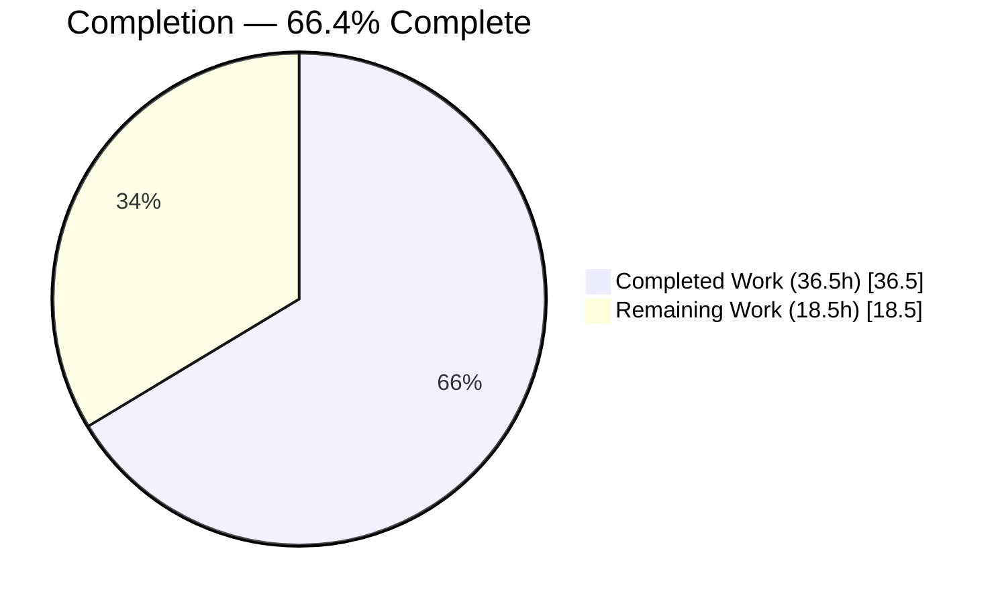
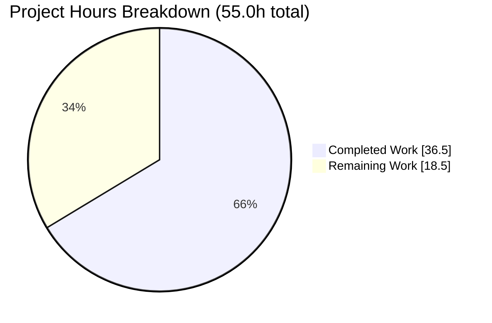
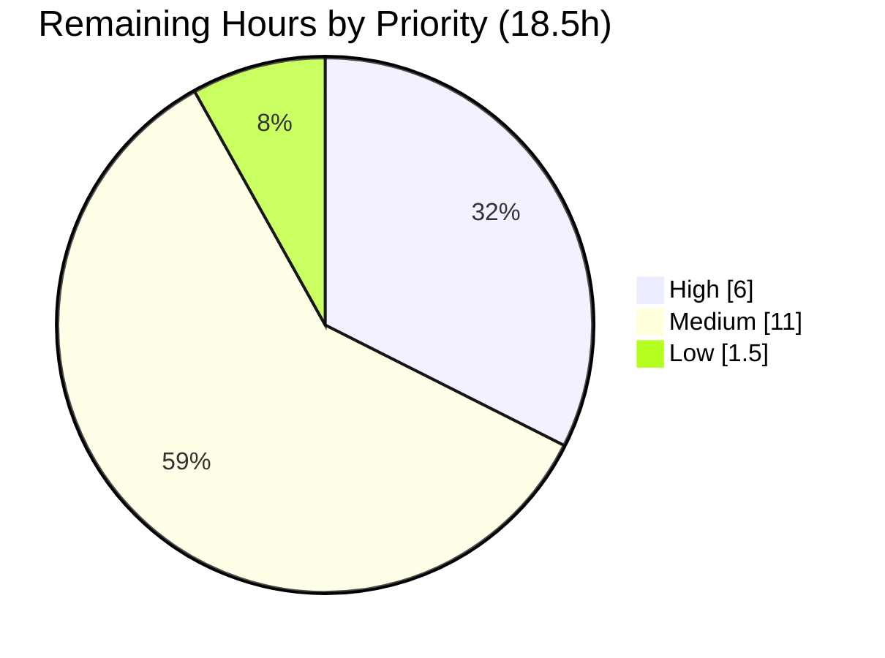
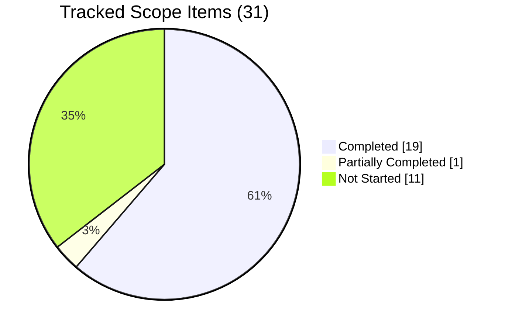

# 1. Executive Summary

## 1.1 Project Overview

`BlitzyRepo1` is a minimal Node.js HTTP service. One file, `server.js`, binds the loopback interface `127.0.0.1:3000` and answers every request with a fixed 34-byte plain-text greeting, using only Node's built-in `http` module — no framework, no manifest, no dependencies. This engagement made that file clean, fully self-documenting code without changing what the program does, and hardened two runtime edges: the response security-header posture and the startup-failure path. A later refinement pass re-audited every comment claim against the running service and confirmed the delivered contract byte for byte. Its audience is the developer or operator who runs the service locally and needs to read, trust and extend it.

## 1.2 Completion Status



Chart colours: Completed = Dark Blue `#5B39F3`; Remaining = White `#FFFFFF`.

| Metric | Value |
|---|---|
| Total Hours | 55.0 |
| Completed Hours (AI + Manual) | 36.5 |
| Remaining Hours | 18.5 |
| Percent Complete | **66.4%** |

Calculation: `36.5 / (36.5 + 18.5) × 100 = 66.4%`. Of 31 tracked scope items, 19 are complete, 1 is partially complete and 11 are not started.

## 1.3 Key Accomplishments

- All 21 functional elements of `server.js` carry an accurate comment; zero uncommented executable lines.
- Every comment claim holds against the running service — 24 claims checked, none needing correction.
- Runtime contract byte-exact: `200`, `text/plain`, `Content-Length: 34`, greeting plus one newline.
- Catch-all invariance across methods, paths, queries, headers and bodies; no request data reaches the response.
- `nosniff` and `X-Frame-Options: DENY` on every response; framing refusal enforced in a real browser.
- A failed bind reports one 54-byte line and exits `1`; all three branches exercised, nothing disclosed.
- Loopback-only exposure proven — the host's LAN address and the IPv6 loopback are both refused.
- Dependency surface is still one Node core import; no manifest, lockfile or `node_modules`.

## 1.4 Critical Unresolved Issues

12 of 31 tracked scope items remain open. None blocks running the service; five affect release readiness.

| Issue | Impact | Owner | ETA |
|---|---|---|---|
| No automated test suite exists (0 tests in the repository) | Nothing guards the greeting, headers, startup line or bind guard against a future edit | Development team | 3.0h |
| No CI gate | Nothing runs the syntax check or a suite on push | Development team | 2.0h |
| Nothing pins the runtime — no manifest, no `engines` constraint | The Node ≥ 22.12 requirement is carried by convention only | Development team | 1.0h |
| No deployment definition, service unit, restart policy or health route | Deployment today is a manual, unsupervised `node server.js` | Platform / DevOps | 3.0h |
| The committed technical specification describes a five-header response with no security headers | An integrator reading it builds against a contract the service no longer has | Development team | 2.0h |
| `HEAD` and `HTTP/1.0` replies declare no `Content-Length` (`server.js:29-31`) | A client that sizes the payload from headers learns nothing; needs a scope decision | Product owner | 1.5h |
| Host and port hardcoded with zero environment reads (`server.js:9,11`) | One instance per host; relocation requires a code change | Product owner | 1.5h |
| No linter or formatter configuration | Style is maintained by hand; `node --check` is the only automated gate | Development team | 1.5h |
| No connection or per-socket caps; socket timeout unset | Concurrency is unbounded, mitigated only by loopback exposure | Development team | 1.5h |
| Three settled form-and-contract decisions await a recorded disposition — parameter-documentation form, `Content-Type` charset, method-token boundary (3 items) | Documentation and contract form only; no runtime effect | Product owner | 1.5h |

## 1.5 Access Issues

No access issues identified. The service reads no environment variables and needs no secret, credential, registry, database or third-party API.

| System/Resource | Type of Access | Issue Description | Resolution Status | Owner |
|---|---|---|---|---|
| — | — | None required or requested | N/A | — |

## 1.6 Recommended Next Steps

1. **[High]** Add a contract regression suite with the built-in `node:test` runner covering the 34-byte body, status, headers, startup line and the bind guard's branches (3.0h).
2. **[High]** Add `package.json` with an `engines` pin for Node ≥ 22.12 and a `test` script (1.0h).
3. **[High]** Add a CI gate running `node --check server.js` and the new suite on every push (2.0h).
4. **[Medium]** Refresh the committed technical specification against the delivered seven-header response and the current source line numbers (2.0h).
5. **[Medium]** Define deployment and process supervision, and settle the `Content-Length` and host/port decisions (6.0h).

# 2. Project Hours Breakdown

## 2.1 Completed Work Detail

| Component | Hours | Description |
|---|---:|---|
| Comment and clean-code pass on `server.js` | 3.0 | All 21 functional elements annotated with intent-focused comments, from the file header to the startup log; formatting, style and trailing newline preserved; no dead code or unused bindings (`server.js:1-63`) |
| Protocol-boundary documentation | 1.5 | `HEAD`/`HTTP/1.0` framing and the parser's method-token and `CONNECT` behaviour documented at the lines that cause them (`server.js:14-15`, `:29-31`), each claim first confirmed against the running service |
| Response security headers | 1.5 | `X-Content-Type-Options: nosniff` and `X-Frame-Options: DENY` added inside the handler with intent comments (`server.js:23-28`) |
| Startup-failure guard | 2.5 | `server.on('error')` registered before `listen`, with EADDRINUSE, EACCES and generic branches, an `UNKNOWN` code fallback and a defined exit status; written so the error object can never be formatted (`server.js:35-58`) |
| Behaviour-contract preservation and non-drift proof | 2.0 | Executable-token identity against the pre-change baseline — 24 executable lines and an identical executable-stream hash on both sides — plus payload byte arithmetic and before/after runtime differentials |
| Static build gate | 0.5 | `node --check server.js` established as the project's only build target and re-run against the working tree and the committed content |
| HTTP response-contract verification | 3.0 | Method, path, header, body and `Accept` invariance; `HEAD` and `HTTP/1.0` framing; keep-alive socket reuse; encoded, UTF-8, long-but-bounded and empty-body edge cases |
| Startup, listener and lifecycle verification | 2.0 | Exact startup line and empty stderr; loopback-only bind with wildcard and IPv6 ruled out; sequential and bounded-concurrent load; stop, port release and clean restart |
| Exposure, posture and log-hygiene verification | 2.0 | Non-loopback and IPv6 unreachability; header disclosure and CORS posture; secret, credential and PII exclusion from logs and responses; dependency-surface discovery |
| Hostile-input non-reflection verification | 1.5 | XSS, SQL, command, traversal, Unicode, encoded-CRLF, null-byte, template-expression, prototype and credential shapes across every request carrier — none reflected, executed or logged |
| Protocol robustness and availability verification | 1.5 | Malformed request lines, ambiguous `Content-Length`/`Transfer-Encoding` framing including a smuggling attempt, oversized headers and URIs, a 1 MiB body, request bursts, socket churn and pinned connections |
| Browser corroboration | 1.0 | Real-browser render of the greeting and enforcement of `X-Frame-Options: DENY` against a same-origin frame, with console and network inspection |
| Static code review across five lenses | 2.5 | Interface and backend logic, startup observability, requirement completeness, rule compliance, security posture and comment quality, each with mechanical inventories |
| Final acceptance verification of the delivered tree | 2.0 | End-to-end pass over the merged result: boot, contract, headers, hostile input, bind failure, recovery, restart and repository integrity |
| Refinement audit of `server.js`, both halves | 3.0 | Claim-by-claim re-audit of the request-handling half (`:1-33`) and the startup/failure half (`:34-64`) against the code as written and against observed runtime behaviour — 24 comment claims accurate, 21/21 elements covered, hygiene measured clean, verdict: no change warranted |
| Failure-path branch verification as real operating-system failures | 1.5 | EACCES driven against the host's administered port exclusions and the generic branch against an unassignable address, each returning a code-only diagnostic and exit `1`; an unguarded copy proved the 650-byte stack-and-version disclosure the guard suppresses |
| Independent review of the refined tree plus final acceptance | 2.5 | Five review lenses over the refined source — rule compliance, backend behaviour preservation, security posture, completeness, comment accuracy — then a final acceptance gate that re-derived the file hash, the payload hash, the contract values and the rule coverage from scratch |
| Runtime acceptance campaign on the refined tree | 3.0 | Full re-drive of the contract, catch-all invariance, framing boundaries, raw-socket parser seams, non-reflection, bind failure, lifecycle and browser behaviour against the running service |
| **Total** | **36.5** | |

## 2.2 Remaining Work Detail

| Category | Hours | Priority |
|---|---:|---|
| Automated contract regression suite (`node:test`) for the body, status, headers, startup line and bind-guard branches | 3.0 | High |
| Package manifest with a Node `engines` pin and a `test` script | 1.0 | High |
| CI gate running the syntax check and the new suite on every push | 2.0 | High |
| Deployment and process supervision: service definition, restart policy, readiness-probe approach | 3.0 | Medium |
| Committed technical specification refresh: the delivered seven-header response and current source line numbers | 2.0 | Medium |
| Explicit `Content-Length` for `HEAD` and `HTTP/1.0` — scope decision, one-line change, re-verification | 1.5 | Medium |
| Host and port configurability decision, with the loopback default re-verified if changed | 1.5 | Medium |
| Linter and formatter configuration, run clean over the file | 1.5 | Medium |
| Connection and per-socket limits plus timeout profile review | 1.5 | Medium |
| Request-handler parameter-documentation form: record the disposition | 0.5 | Low |
| `Content-Type` `charset` parameter decision | 0.5 | Low |
| Method-token and `CONNECT` contract decision | 0.5 | Low |
| **Total** | **18.5** | |

## 2.3 Hours Reconciliation

| Check | Value |
|---|---:|
| Section 2.1 completed total | 36.5 |
| Section 2.2 remaining total | 18.5 |
| Total project hours (2.1 + 2.2) | 55.0 |
| Percent complete (36.5 ÷ 55.0) | 66.4% |

The completed figure covers the documentation pass, the two hardening changes, the refinement audit that re-established both against the running service, and the verification work that proved them. The remaining figure covers one partially delivered documentation-form item and eleven path-to-production activities and open decisions, none of which was in the delivery scope. Confidence is high on the completed side, where every claim is backed by a repository line or an executed check; medium on deployment and supervision, which depend on a target environment that has not been chosen.

# 3. Test Results

Every figure below was observed against the delivered tree on Node v22.23.2, with each response captured to a file and judged over its raw bytes rather than console text. The repository contains no test framework and no coverage instrumentation, so verification is executed directly against the running service and the static gate; no coverage percentage can be quoted for any row.

| Area / Category | Framework | Tests | Passed | Failed | Coverage | What This Proves |
|---|---|---:|---:|---:|---|---|
| Static build gate | `node --check` | 1 | 1 | 0 | n/a | `server.js` parses with zero diagnostics — the project's only build target |
| Automated regression suite | `node:test` | 0 | 0 | 0 | 0% | No suite exists: the runner reports zero tests and no manifest defines one |
| Response contract | curl + byte comparison | 12 | 12 | 0 | n/a | The delivered contract holds exactly — `200`, `text/plain`, the seven-header set, and a byte-exact 34-byte payload ending `0x0A` |
| Catch-all invariance | curl request matrix | 8 | 8 | 0 | n/a | Eight request shapes, hostile ones included, return the identical payload; nothing from a request reaches the response |
| Protocol framing and parser boundaries | curl, raw method token | 4 | 4 | 0 | n/a | `HEAD`, `HTTP/1.0`, keep-alive socket reuse and an unlisted method token behave exactly as the source documents |
| Network exposure | curl + TCP listener table | 5 | 5 | 0 | n/a | One loopback listener and nothing else — the host's LAN address and the IPv6 loopback both refuse the connection |
| Startup observability and log hygiene | shared-access log reads | 5 | 5 | 0 | n/a | Startup emits exactly one 41-byte line, stderr stays silent, and no request is ever logged |
| Startup-failure guard and lifecycle | second instance, owner-matched stop | 12 | 12 | 0 | n/a | A bind conflict exits `1` with a single 54-byte diagnostic, the incumbent keeps serving, and the port frees and re-binds cleanly |
| **Total** | | **47** | **47** | **0** | | |

### Not Covered

- **No automated test protects any of it.** There are zero tests in the repository. Everything above was executed by hand; a future edit to `server.js` will not be caught by anything except `node --check`, which only proves the file parses. This is the single largest verification gap and the first item of remaining work.
- **The comment text itself is untestable.** Comments are not executable, so no test or runtime check can assert them. They were checked statically instead — line classification, delimiter and tag counts, position checks against the code each annotates, and byte comparison of the executable lines against the pre-change baseline. A human should read the file once to confirm the prose still matches the code before release.
- **The `EACCES` and generic branches of the startup guard were not exercised on port 3000 itself.** That port cannot be made to fail those ways on a normal host, so those branches were driven as real operating-system failures against copies of the file that differ only in the port or host literal. The `EADDRINUSE` branch — the one an operator actually meets — was exercised against the real file on the real port.
- **No load, soak or performance testing.** Correctness under bursts and bounded concurrency was checked; throughput, latency targets and sustained-load behaviour were not, and no performance budget exists to test against.
- **No authentication, authorisation or persistence testing, because there is nothing to test.** The service exposes no login route, no session, no token issuance and no protected resource, and it has no database or persistence layer; credentials neither gate nor alter the response.

# 4. Runtime Validation & UI Verification

The service was started, driven and stopped against `http://127.0.0.1:3000/` on Node v22.23.2. It has no user interface beyond the plain-text response; browser verification therefore covers rendering and header enforcement rather than screens.

- ✅ **Operational — Start-up and readiness.** `node server.js` binds and answers on the first readiness poll; stdout is exactly `Server running at http://127.0.0.1:3000/` (41 bytes, one line, no carriage return) and stderr is empty.
- ✅ **Operational — Loopback binding.** A single listener on `127.0.0.1:3000` owned by the started process; no wildcard, IPv6 or additional port, and the host's own LAN address refuses the connection while the loopback control succeeds.
- ✅ **Operational — Greeting response.** `HTTP/1.1 200 OK`, `Content-Type: text/plain`, `Content-Length: 34`, seven headers in total, body byte-identical to `Hello, World Welcome to Sharebot!` plus one newline (last byte `0x0A`).
- ✅ **Operational — Catch-all invariance.** Every method, path, query string, header set and body tried returned the identical payload, including `/.env` and an encoded `<script>` path; nothing from the request reaches the response.
- ✅ **Operational — Security headers.** `X-Content-Type-Options: nosniff` and `X-Frame-Options: DENY` present on every response, including `HEAD` and `HTTP/1.0` replies; no `Server`, `X-Powered-By`, `X-Runtime` or `Via`.
- ✅ **Operational — Browser render.** A real browser reports `document.contentType` as `text/plain` and wraps the payload in its own plain-text viewer — `<body><pre …>` holding a single text node of exactly 34 characters ending in code `10` — so the bytes are never parsed as markup. The navigation produces zero console messages.
- ✅ **Operational — Framing refusal.** A same-origin frame pointing at the endpoint is blocked: the console reports `Refused to display 'http://127.0.0.1:3000/' in a frame because it set 'X-Frame-Options' to 'deny'.`, `contentDocument` is `null`, the network panel marks the frame request `net::ERR_BLOCKED_BY_RESPONSE`, and the greeting never appears inside the frame.
- ✅ **Operational — Startup-failure diagnostics.** A second instance against the bound port exits `1`, writes nothing to stdout, and writes one 54-byte line: `Cannot start server: 127.0.0.1:3000 is already in use`. Twelve internal-disclosure tokens were searched for and none appears. The running instance is untouched and its next request is byte-exact.
- ✅ **Operational — Stop, release and restart.** An owner-matched stop frees the port immediately: zero listeners and a refused connection afterwards; a restart re-binds and reproduces the identical startup line and response.
- ⚠ **Partial — `HEAD`, `HTTP/1.0` and parser-unlisted methods.** `HEAD` and `HTTP/1.0` return `200` with the correct media type and both security headers but declare no `Content-Length`, and the `HTTP/1.0` body is delimited by connection close. `CONNECT` receives zero bytes and no status line, and syntactically valid tokens such as `FOOBAR` receive a bare `400`. All of it is decided by Node before the handler runs, and all of it is documented in the source rather than widened.

**Not exercised at runtime:** the `EACCES` and generic-code branches of the startup guard on port 3000 itself (driven on port- and host-substituted copies instead, because that port cannot be made to fail those ways); sustained load and performance behaviour; and any authentication flow, because the service has no authentication surface to drive.

# 5. Compliance & Quality Review

## 5.1 Compliance Matrix

Each row is the verified state of the delivered tree today.

| # | Deliverable / Benchmark | Status | Evidence |
|---|---|---|---|
| 1 | Every functionality carries an explanatory comment (the project's governing rule) | ✅ PASS | 21 functional elements annotated; zero uncommented executable lines out of 24; `server.js:1-63` |
| 2 | Clean code and hygiene: no dead code or stale prose, comments explain intent, and every claim is true of the code and of observed behaviour | ✅ PASS | 0 `TODO`/`FIXME`/`XXX`/`HACK`/placeholder markers; 0 commented-out statements; 64 lines and 3 458 bytes with longest line 95 chars, 0 tabs, 0 trailing-whitespace lines, 2-space indentation and exactly one trailing newline; `const`-only bindings; 24 comment claims audited individually, with the framing, parser and disclosure claims confirmed against the running service |
| 3 | Runtime behaviour unchanged: status, media type, payload, startup line | ✅ PASS | `200` / `text/plain` / `Content-Length: 34` / byte-exact 34-byte body; 41-byte startup line |
| 4 | Loopback-only exposure on `127.0.0.1:3000` | ✅ PASS | Single listener; wildcard, IPv6 and LAN reachability all ruled out |
| 5 | Catch-all handler with no request inspection or routing | ✅ PASS | Zero `req` property reads, zero branches, zero route registrations; every request shape returns the identical payload |
| 6 | Dependency posture: Node core `http` only | ✅ PASS | One `require`, specifier `'http'`; no manifest, lockfile or `node_modules` |
| 7 | Scope discipline: only `server.js` modified | ✅ PASS | 6 of the branch's 8 commits touch `server.js`, 50 insertions and 0 deletions; `README.md` and `LICENSE` untouched |
| 8 | Response security posture | ✅ PASS | `nosniff` and `X-Frame-Options: DENY` on every response; no `Server`, `X-Powered-By`, `X-Runtime` or `Via` |
| 9 | Diagnostic hygiene: no version, path or stack disclosure | ✅ PASS | Bind failure emits one 54-byte line; `err.stack`, `err.message` and `${err}` all absent from the source, with `err.code` the only property read |
| 10 | Typed parameter documentation in JSDoc block form | ⚠ PARTIAL | Typed `@param` tags present as `//` comments at `server.js:16-17` and `:40`; 3 tags, 0 block comments — see 5.2 |
| 11 | Committed technical specification matches the delivered behaviour | ❌ NOT MET | The specification states the security response headers are absent and the reply carries exactly five headers; the service emits seven — see 5.2 |
| 12 | Automated quality gates: tests, coverage, lint, CI | ❌ NOT MET | No suite, coverage tool, linter config or pipeline exists; `node --check` is the only gate |

## 5.2 AAP & Rule Divergences and Gaps

The AAP for this engagement carried no requirement inventory, so the governing authority was the single user rule — clean code with a comment on each functionality — as decomposed for `server.js`, together with the behaviour contract that decomposition froze and the human's later request to refine the delivered pull request. Eight divergences from that authority were identified.

| # | What the AAP/Rule Required | What Was Delivered Instead | Why It Diverged | Impact | Remediation |
|---|---|---|---|---|---|
| 1 | A refinement pass over the delivered pull request | An evidenced audit of both halves of `server.js` that changed nothing | The audit found no inaccurate comment and no uncommented functionality; **Sanctioned** — an evidenced "no change required" outcome is the agreed complete result | No new capability; the comment set and contract are now independently re-verified | None — decide only whether a differently scoped refinement is wanted |
| 2 | No change to the emitted response headers | Two security headers added (`server.js:25,28`) | Security verification of the response posture mandated them; **Sanctioned** | Two extra response headers; every stated contract element preserved | None — do not revert |
| 3 | No error handlers | A `server.on('error')` bind guard added (`server.js:41-58`) | Verification of the startup path mandated it; **Sanctioned** | Only the previously ungraceful failure path changed | None — do not revert |
| 4 | Committed documentation that describes the delivered service | A specification that still describes a five-header response with no security headers, citing line numbers from an earlier revision | Exactly one file was permitted to change and the documentation was explicitly read-only; **Sanctioned** scope decision | An integrator reading it builds against a contract the service no longer has | Refresh the affected sections (2.0h) |
| 5 | A JSDoc `/** */` block documenting the parameters, in the fuller wording the decomposition suggested | The same typed `@param` tags as `//` comments, deliberately terse (`server.js:16-17`, `:40`) | The governing instructions cannot all hold at once; the terse wording is a settled decision | Documentation form only; no runtime effect | Owner records the disposition (0.5h) |
| 6 | An explicit `Content-Length` on every reply | The framing boundary documented at its cause (`server.js:29-31`) | Changing headers was forbidden | `HEAD`/`HTTP/1.0` clients cannot size the payload from headers | Scope decision, then a one-line change (1.5h) |
| 7 | Every method returns the same response | Parser-imposed limits documented (`server.js:14-15`) | The limit lives in Node, before any application code | Unlisted method tokens get `400`; `CONNECT` gets no bytes | Confirm the contract, or raise widening as new scope (0.5h) |
| 8 | An automated suite was out of scope and none was created | Verification performed directly against the running service | Creating test files was explicitly forbidden | Nothing automated guards the delivered behaviour | Add a suite and a CI gate (5.0h) |

**1 — The refinement request was answered with a zero-change audit.** You asked for the delivered pull request to be refined. Both halves of `server.js` were then audited element by element — 24 comment claims checked against the code as written and against the running service, all 21 functional elements checked for coverage, and hygiene measured — and the correct answer was that nothing needed changing. `server.js` therefore stands at the same content it had before the request, with the branch's server.js diff still `+50 / -0`. This is the sanctioned outcome: churn invented only to produce a diff would have been the wrong answer. What you gained is confidence rather than code. If you want a refinement with a different objective — behaviour, structure or tooling — say so explicitly, because a content-free request cannot authorise one.

**2 — Security headers added despite a freeze on the header set.** The documentation mandate for `server.js` forbade changing headers and demanded byte-identical non-comment tokens. Security verification of the running service then established that no response declared any MIME-sniffing or framing policy, and mandated both headers explicitly while ruling out middleware or any dependency. They were added add-only at `server.js:25` and `:28`, taking the response from five headers to seven and changing nothing else: status, media type, `Content-Length: 34` and the 34-byte body are all intact, and framing refusal is confirmed in a real browser. Treat this as sanctioned scope, not drift — if the header set must return to five, revert those two statements deliberately and record the absent controls as accepted risk.

**3 — A bind-failure handler added despite a freeze on error handlers.** The same mandate listed error handlers among the things a comment pass does not authorise. Verification of the startup path then established that a listen failure would terminate the process through an unhandled `'error'` event, writing an internal stack trace and the exact runtime version to stderr — routinely reachable, because the address is hardcoded and cannot be relocated. The guard at `server.js:41-58` is registered before `listen`, reads only `err.code` with an `UNKNOWN` fallback, prints one line per failure class and exits `1`. A copy with the guard removed was made to fail the same way and emitted 650 bytes of stack, `errno` dump and runtime version; the delivered guard emits 54 bytes with none of it. Sanctioned, and it should not be reverted.

**4 — The committed technical specification no longer matches the service.** `blitzy/documentation/Technical Specifications.md` states that the security response headers are absent (lines 3179, 4736, 5342, 5735, 6020) and that the reply carries "exactly five headers" (lines 6019, 6366), and it locates the handler at "lines 6–10" and the listener at "lines 12–14" (lines 123, 124, 436, 467) — positions from the 14-line source that predates the comment pass. The service actually emits seven headers including `nosniff` and `X-Frame-Options: DENY`, from a 64-line file. The delivery scope permitted exactly one file to change and made the documentation read-only, so no correction was possible inside it. This is the one open item in committed content a human must actively close; budget 2.0h and treat the current text as untrustworthy until then.

**5 — Parameter documentation is in line-comment form, with settled terse wording.** The governing instructions ask for a JSDoc block documenting `@param {http.IncomingMessage} req`, `@param {http.ServerResponse} res` and `@param {Error & { code?: string }} err`, in fuller prose than the file carries, while also freezing every non-comment token, forbidding rearrangement, and preserving the inline arrow callbacks. Those cannot all hold: above the statement a block binds its tags to the non-callable `server` constant, and attaching one to an arrow function requires reformatting the call. The typed tags were therefore delivered as `//` comments at `server.js:16-17` and `:40`, and the condensed wording elsewhere is a deliberate density decision. Accept this form, or approve extracting a named listener to carry a real block — which forfeits the token-identity guarantee.

**6 — Explicit `Content-Length` declined and documented instead.** `HEAD` and `HTTP/1.0` replies return `200` with the correct media type and both security headers, but no declared length; the `HTTP/1.0` body is delimited by connection close. The cause is a single omission — `res.end()` sets no explicit length, so all framing is Node's, and Node skips the header for a bodyless `HEAD` and for `HTTP/1.0`. Declaring the length would emit headers the frozen baseline does not emit, so the boundary was documented at `server.js:29-31` instead. The payload is intact and byte-exact in both cases. Decide whether a universal `Content-Length` is wanted; one approval covers both.

**7 — The catch-all contract is bounded by Node's parser.** "Every method returns the same response" holds for every path, header and body, and for the method tokens Node's parser lists — but syntactically valid tokens outside that list receive a bare 47-byte `400`, matching is case-sensitive, and `CONNECT` receives no bytes at all because Node routes it to an event this module does not bind. None of that is reachable from `server.js`: the rejection happens before any application code runs, and the two interceptions that could change it were both forbidden. The behaviour is documented at `server.js:14-15`. Confirm this is the intended contract, or raise widening it as new scope.

**8 — No automated suite exists, so nothing guards the delivered behaviour.** Creating a test file, manifest or linter configuration was explicitly out of scope, so verification was performed directly against the running service: the byte-exact contract, the header set, the startup line and the bind guard were all driven by hand and all pass. The consequence for you is concrete rather than theoretical — `node --test` finds zero tests, `npm test` finds no manifest, and the only automated gate is `node --check`, which proves the file parses and nothing more. Any future edit can silently break the 34-byte contract. Adding a small `node:test` suite and a CI gate is the highest-value remaining work.

# 6. Risk Assessment

These are forward-looking exposures in the delivered service, ordered by how much they should influence the next decision.

| Risk | Category | Severity | Probability | Mitigation | Status |
|---|---|---|---|---|---|
| No automated test guards the byte-exact greeting, the header set, the startup line or the bind guard | Technical | High | High | Add a `node:test` contract suite and wire it to a CI gate (5.0h, Section 2.2) | Open |
| Nothing pins the runtime — no manifest, no `engines` constraint — so the service can be launched on a Node version its behaviour was never confirmed on | Technical | Medium | Medium | Add `package.json` with `engines: node >= 22.12` (1.0h) | Open |
| The committed technical specification describes a five-header response with no security headers and locates code at line numbers from an earlier revision, so an integrator reading it builds against a contract the service no longer has | Integration | Medium | High | Refresh the affected sections against the delivered response and the current source (2.0h) | Open |
| No deployment definition, service unit or restart policy, and observability is one startup line with no health or readiness route — a crash or host reboot leaves the service down and unnoticed | Operational | Medium | High | Define supervision, restart policy and a probe approach; a TCP or HTTP probe on `127.0.0.1:3000` works today (3.0h) | Open |
| Host and port hardcoded with zero configuration surface — one instance per host, and relocation needs a code change | Operational | Medium | High | Take the configurability decision; keep the loopback default if wider exposure is not wanted (1.5h) | Open |
| Connection concurrency is uncapped (`maxConnections` and `maxRequestsPerSocket` unset, socket timeout unset); only Node's header and keep-alive timeouts reclaim sockets | Security | Medium | Low while loopback-only | Set explicit caps and review the timeout profile before any wider exposure (1.5h) | Open |
| Every security guarantee rests on the loopback bind. Widening it, or ever returning request-influenced content, escalates the accepted low-severity items (no `charset`, permissive legacy framing) from negligible to material | Security | High if exposed | Low | Treat any change to the bind address as requiring a fresh security review; state the loopback constraint in the deployment record | Open |
| `HEAD` and `HTTP/1.0` clients cannot learn the payload size from headers, so an integrator that sizes before fetching gets nothing | Integration | Low | Medium | Approve the explicit `Content-Length` change; one line covers both cases (1.5h) | Open |

# 7. Visual Project Status

### Project Hours



Colours: Completed Work = Dark Blue `#5B39F3`; Remaining Work = White `#FFFFFF`. Accent headings use Violet-Black `#B23AF2`; highlights use Mint `#A8FDD9`.

### Remaining Work by Priority



### Scope Item Status



### Remaining Hours by Category

| Category | Hours | Share |
|---|---:|---:|
| Test automation and CI | 5.0 | 27% |
| Contract and configuration decisions | 3.5 | 19% |
| Deployment and supervision | 3.0 | 16% |
| Tooling: manifest and linting | 2.5 | 14% |
| Committed documentation refresh | 2.0 | 11% |
| Hardening review | 1.5 | 8% |
| Documentation-form and encoding decisions | 1.0 | 5% |
| **Total** | **18.5** | **100%** |

# 8. Summary & Recommendations

**What was delivered.** `server.js` is clean, fully commented code: a file header stating the module's purpose and start command, and an intent-focused comment on each of its 21 functional elements, including the non-obvious ones — why the address is loopback, why the trailing newline counts towards the payload length, and why Node's parser rather than this file decides which method tokens ever reach the handler. The program itself was not refactored; every original statement and literal survives untouched, and the greeting is byte-identical. Two runtime edges were also closed: every response now carries `X-Content-Type-Options: nosniff` and `X-Frame-Options: DENY`, and a failed bind now reports one actionable line and exits `1` instead of terminating with an internal stack trace and the runtime version on stderr. The whole change is 50 added lines in one source file across the branch's eight commits; `README.md` and `LICENSE` are untouched, and the repository still has no dependencies.

**What was verified.** The service was started, driven and stopped repeatedly. The contract holds without deviation: `200`, `Content-Type: text/plain`, `Content-Length: 34`, seven headers, and a body byte-identical to `Hello, World Welcome to Sharebot!` plus one newline, returned identically across every method, path, header, body and `Accept` value tried. Exposure is provably confined to loopback — the host's LAN address and the IPv6 loopback are refused while the loopback control succeeds. Nothing from a request is ever reflected or logged: adversarially shaped input across every carrier left the payload, the header set and the logs untouched. A real browser renders the greeting inside its own plain-text viewer, never parsing it as markup, and is refused outright when the endpoint is framed. Separately, every comment in the file was re-audited claim by claim against the running program: 24 claims, all accurate, none requiring correction. Of 47 checks executed here, 47 passed.

**Where the gaps are.** The service works; what it lacks is everything that would keep it working. There is no test suite, no coverage tool, no linter configuration and no CI pipeline — `node --check` is the only automated gate, and it proves nothing beyond the file parsing. Nothing pins the Node version the behaviour was confirmed on. There is no deployment definition, service unit or restart policy, and no health route, so supervision has to be inferred from a TCP probe. Host and port are hardcoded with zero environment reads, which means exactly one instance per host. And the committed technical specification has fallen behind the code it describes: it still presents a five-header response with no security headers, so it must be refreshed before anyone integrates from it. Three smaller decisions remain open, and each is genuinely a decision rather than work: whether `HEAD` and `HTTP/1.0` should declare `Content-Length`, whether `Content-Type` should carry a `charset`, and which documentation form the parameter tags should take.

**Critical path to production.** Add a small `node:test` contract suite first — the byte-exact body, status, both security headers, the exact startup line and the bind guard's branches — because it is what makes every other change safe. Add a manifest with an `engines` pin next so the runtime is no longer a convention, then a CI job running the syntax check and the suite on every push. With those three in place (6.0h of the 18.5h remaining), refresh the committed specification so the documentation and the code agree, and let the deployment and supervision work proceed against a codebase that defends itself. Settle the `Content-Length` and configurability decisions in the same pass, since both change observable behaviour and both want re-verification.

**Production readiness.** The project is **66.4% complete** on hours (36.5 of 55.0), and the delivered artifact is **ready to run but not yet ready to own**. As a loopback-bound greeting service it is correct, safe and well documented: no security defect was found, no request data reaches a sink, the failure path is graceful, and every claim in the source has now been checked twice against the running program. What is missing is the engineering scaffolding around it, plus one documentation correction. Success is measurable and cheap here — the contract test suite green in CI, a pinned runtime, a specification that matches the response, and a documented start-and-supervise procedure. Until then, treat any edit to `server.js` as unguarded and re-run the verification recipe in Section 9 by hand.

# 9. Development Guide

Every command below was executed against this repository on Node v22.23.2 and produced the output shown.

### System Prerequisites

| Requirement | Verified value | Notes |
|---|---|---|
| Node.js | v22.23.2 | Must be ≥ 22.12; this is the version the behaviour was confirmed on |
| npm | 10.9.8 | Present but unused — there is no manifest to install from |
| curl | 8.13.0 | Any HTTP client works; the recipes below use curl |
| git | 2.55.0 | For cloning only |
| OS | Any platform Node supports | Verified on Windows Server 2022; the service itself is platform-neutral |
| Disk / memory | < 2 MB of source, ~35 MB RSS | Resident set observed between 31 MB and 37 MB under load |

```bash
node --version    # v22.23.2
npm --version     # 10.9.8
curl --version    # curl 8.13.0
```

### Environment Setup

There is nothing to set up. The service reads **zero** environment variables, has no `.env`, no configuration file, no secret and no external service.

```bash
git clone <repository-url>
cd BlitzyRepo1

# Confirm the only import is a Node core module — nothing to install.
node -e "console.log(require.resolve('http'))"   # prints: http
```

Do **not** run `npm install`: there is no `package.json`, no lockfile and no `node_modules`, by design.

### Dependency Installation

None. The repository tracks five files — `server.js`, `README.md`, `LICENSE`, `blitzy/documentation/Project Guide.md` and `blitzy/documentation/Technical Specifications.md` — of which only `server.js` is code, and it imports only Node's built-in `http`.

### Build / Static Gate

`node --check` is the project's only build target. It exits `0` with no output.

```bash
node --check server.js    # exit 0, no output
```

On Windows PowerShell, native stderr is rendered as `NativeCommandError` noise, so capture through `cmd` and trust the exit code:

```powershell
cmd /c "node --check server.js > check.log 2>&1"
$LASTEXITCODE                 # 0
(Get-Item check.log).Length   # 0
```

### Application Startup

```bash
node server.js
# Server running at http://127.0.0.1:3000/
```

That single line — 41 bytes including its newline — is the readiness signal. It is printed only after the bind succeeds, so if you see it, the port is open. Stop the service with Ctrl+C.

### Verification Steps

**Quick check.**

```bash
curl -s -i http://127.0.0.1:3000/
# HTTP/1.1 200 OK
# Content-Type: text/plain
# X-Content-Type-Options: nosniff
# X-Frame-Options: DENY
# Date: ...
# Connection: keep-alive
# Keep-Alive: timeout=5
# Content-Length: 34

curl -s -o /dev/null -w '%{num_headers} %{http_code} %{size_download}\n' http://127.0.0.1:3000/   # 7 200 34
curl -s http://127.0.0.1:3000/ | wc -c                                                            # 34
```

**Byte-exact check (POSIX).**

```bash
node server.js > srv-out.log 2>&1 &
sleep 2
cat srv-out.log                                   # Server running at http://127.0.0.1:3000/
curl -s http://127.0.0.1:3000/ -o body.bin
cmp body.bin <(printf 'Hello, World Welcome to Sharebot!\n') && echo BYTE_EXACT
kill %1
```

Redirect the server's output to a file rather than piping it; a backgrounded process holding a pipe open can make the shell look as though it has hung.

**Byte-exact check (Windows PowerShell).** Call `curl.exe` by full path — bare `curl` is an alias for `Invoke-WebRequest` and will not accept `-s -i`. A running process holds an exclusive lock on its redirect log, so open it with shared access.

```powershell
$p = Start-Process node -ArgumentList 'server.js' -PassThru -NoNewWindow `
     -RedirectStandardOutput srv-out.log -RedirectStandardError srv-err.log
for ($i=0; $i -lt 25; $i++) {
  Start-Sleep -Milliseconds 300
  if (Get-NetTCPConnection -LocalPort 3000 -State Listen -ErrorAction SilentlyContinue) { break }
}

$fs = [IO.File]::Open('srv-out.log','Open','Read','ReadWrite')
(New-Object IO.StreamReader($fs)).ReadToEnd(); $fs.Dispose()   # Server running at http://127.0.0.1:3000/

& 'C:\Windows\System32\curl.exe' -s http://127.0.0.1:3000/ -o body.bin
$b = [IO.File]::ReadAllBytes('body.bin')
$b.Length                                                       # 34
$b[$b.Length-1]                                                 # 10  (trailing LF)
@(Compare-Object $b ([Text.Encoding]::ASCII.GetBytes("Hello, World Welcome to Sharebot!`n")) -SyncWindow 0).Count   # 0

# Stop only the pid you started, after confirming it owns the port.
$owner = (Get-NetTCPConnection -LocalPort 3000 -State Listen -ErrorAction SilentlyContinue).OwningProcess
if ("$owner" -eq "$($p.Id)") { Stop-Process -Id $p.Id -Force }

& 'C:\Windows\System32\curl.exe' -s -o NUL --max-time 5 http://127.0.0.1:3000/
$LASTEXITCODE          # 7 = connection refused, so the port is free again
```

**Startup-failure check.** With the service running, start a second instance from the same directory. It exits `1`, writes nothing to stdout, and writes one 54-byte line to stderr:

```
Cannot start server: 127.0.0.1:3000 is already in use
```

The first instance is unaffected and keeps serving. On Windows, read the exit code with `cmd /c "node server.js > out.log 2> err.log"` followed by `$LASTEXITCODE`; a plain `Start-Process -PassThru` can report an empty `ExitCode` for a redirected child.

**Browser check.** Open `http://127.0.0.1:3000/`. The greeting renders as plain text inside the browser's own viewer with no console output, `document.contentType` is `text/plain`, and any attempt to load the URL in a frame is refused with `Refused to display … 'X-Frame-Options' to 'deny'` and `net::ERR_BLOCKED_BY_RESPONSE`.

### Running a Second Instance

Host and port are hardcoded, so two instances cannot coexist. For exploratory work, copy the file to a scratch directory **outside** the repository, change only the port literal in the copy, and run that. Never write copies or logs inside the checkout — there is no `.gitignore`, so they would show up in `git status`.

```bash
mkdir -p ~/scratch
sed 's/const port = 3000;/const port = 30990;/' server.js > ~/scratch/server-copy.js
node --check ~/scratch/server-copy.js       # exit 0, no output
node ~/scratch/server-copy.js &
# Server running at http://127.0.0.1:30990/     (42 bytes — the line is built from the constants)
curl -s -w '%{http_code} %{size_download}\n' -o /dev/null http://127.0.0.1:30990/   # 200 34
kill %1
```

### Example Usage

Every request gets the same answer, whatever the method, path, query or body:

```bash
curl -s http://127.0.0.1:3000/                              # Hello, World Welcome to Sharebot!
curl -s -X POST http://127.0.0.1:3000/anything?x=1          # Hello, World Welcome to Sharebot!
curl -s -X DELETE http://127.0.0.1:3000/a/b/c -d 'ignored'  # Hello, World Welcome to Sharebot!
```

Two documented boundaries you will notice:

```bash
curl -s -I http://127.0.0.1:3000/                                           # 200, both security headers, no Content-Length
curl -s --http1.0 -i http://127.0.0.1:3000/                                 # 200, Connection: close, no Content-Length
curl -s -o /dev/null -w '%{http_code}\n' -X FOOBAR http://127.0.0.1:3000/   # 400 (Node's parser)
```

### Troubleshooting

| Symptom | Cause | Resolution |
|---|---|---|
| `Cannot start server: 127.0.0.1:3000 is already in use` | Another process holds port 3000 | Find the owner (`netstat -ano \| findstr :3000`, `Get-NetTCPConnection -LocalPort 3000`, or `lsof -i :3000`) and stop only a process you own; or use a port-substituted copy as shown above |
| `curl : A parameter cannot be found that matches parameter name 'i'` | PowerShell aliases `curl` to `Invoke-WebRequest` | Call `& 'C:\Windows\System32\curl.exe'` by full path |
| `The process cannot access the file … because it is being used by another process` | The running server holds an exclusive lock on its redirect log | Open with shared access: `[IO.File]::Open(path,'Open','Read','ReadWrite')` |
| `node --test` prints `1..0` / `# tests 0` | No test suite exists in this repository | Expected, not a failure. Adding a suite is the first item of remaining work |
| `npm error code ENOENT … package.json` (errno `-4058`) | No manifest exists | Expected. Run the service with `node server.js`, not `npm start` |
| `node --check` appears to print an error in PowerShell but exits `0` | PowerShell renders native stderr as `NativeCommandError` | Redirect through `cmd /c` and trust `$LASTEXITCODE` |
| A failing second instance reports an empty exit code | `Start-Process -PassThru` plus `WaitForExit` can leave `ExitCode` unset for a redirected child | Use `cmd /c "node server.js > out.log 2> err.log"` then `$LASTEXITCODE`, or `Start-Process -Wait -PassThru` |
| Response body is 33 bytes, not 34 | The trailing `\n` in the greeting literal was lost | Restore `res.end('Hello, World Welcome to Sharebot!\n');` exactly — the newline is part of the payload |
| Browser shows the text but with odd characters for non-ASCII content | `Content-Type` declares no `charset`, so the browser falls back to a legacy encoding | Harmless for this pure-ASCII body; adding `; charset=utf-8` is an open decision (Section 2.2) |
| Terminal seems to hang after backgrounding the server | The background process is holding the shell's pipe open | Redirect its output to a file instead of piping, and stop it explicitly |
| The committed technical specification describes a five-header response | It predates the security-header work | Trust the running service and Section 4 of this guide; refreshing the specification is tracked in Section 2.2 |

# 10. Appendices

## A. Command Reference

| Purpose | Command | Expected result |
|---|---|---|
| Runtime version | `node --version` | `v22.23.2` |
| Confirm no install is needed | `node -e "console.log(require.resolve('http'))"` | `http` |
| Static gate (only build target) | `node --check server.js` | Exit `0`, no output |
| Test-runner discovery | `node --test` | Exit `0`, `1..0`, `# tests 0` — no suite exists |
| Manifest discovery | `npm test` | `ENOENT … package.json`, errno `-4058` — no manifest exists |
| Start the service | `node server.js` | `Server running at http://127.0.0.1:3000/` |
| Full response | `curl -s -i http://127.0.0.1:3000/` | `200`, `text/plain`, `nosniff`, `DENY`, `Content-Length: 34` |
| Contract in one line | `curl -s -o /dev/null -w '%{num_headers} %{http_code} %{size_download}\n' http://127.0.0.1:3000/` | `7 200 34` |
| Payload size | `curl -s http://127.0.0.1:3000/ \| wc -c` | `34` |
| Headers only | `curl -s -I http://127.0.0.1:3000/` | `200` with both security headers, no `Content-Length` |
| Legacy protocol | `curl -s --http1.0 -i http://127.0.0.1:3000/` | `200`, `Connection: close`, no `Content-Length` |
| Parser boundary | `curl -s -o /dev/null -w '%{http_code}\n' -X FOOBAR http://127.0.0.1:3000/` | `400` |
| Port owner (Windows) | `Get-NetTCPConnection -LocalPort 3000 -State Listen` | One row, `127.0.0.1`, your pid |
| Port owner (POSIX) | `lsof -i :3000` | One listening process |
| Confirm release | `curl -s -o /dev/null --max-time 5 http://127.0.0.1:3000/` | Exit `7` (connection refused) |
| Branch history | `git log --oneline origin/jr-br4..HEAD` | 8 commits |
| Source change size | `git diff --numstat origin/jr-br4 HEAD -- server.js` | `50  0  server.js` |
| Whole-branch change size | `git diff --stat origin/jr-br4 HEAD` | 3 files changed, 9 382 insertions, 0 deletions |

## B. Port Reference

| Port | Bound address | Purpose | Configurable |
|---|---|---|---|
| 3000 | `127.0.0.1` | The only listener the service opens | No — hardcoded at `server.js:11`, zero environment reads |

Only one instance can run per host. For a second instance, use a port-substituted copy outside the repository (Section 9). No other port, socket or IPC channel is opened, and no outbound connection is made.

## C. Key File Locations

| Path | Role | Size |
|---|---|---|
| `server.js` | The entire application: import, constants, request handler, bind guard, listener | 3 458 bytes, 64 lines |
| `server.js:5` | `require('http')` — the only import in the project | — |
| `server.js:9,11` | `hostname` and `port` constants | — |
| `server.js:18-33` | `http.createServer` catch-all handler: status, media type, both security headers, response body | — |
| `server.js:41-58` | `server.on('error')` bind-failure guard and its three branches | — |
| `server.js:61-64` | `server.listen` and the startup-log callback | — |
| `README.md` | Project name only | 13 bytes |
| `LICENSE` | Apache License 2.0 | 11 558 bytes |
| `blitzy/documentation/Project Guide.md` | Committed status snapshot | 545 lines |
| `blitzy/documentation/Technical Specifications.md` | Committed specification; predates the security-header work (Section 5.2) | 8 787 lines |

There is no `src/`, `test/`, `dist/`, `node_modules/` or configuration directory. `blitzy/screenshots/` holds browser evidence images and is intentionally untracked.

## D. Technology Versions

| Component | Version | Source |
|---|---|---|
| Node.js | v22.23.2 | Host installation; not pinned by the repository |
| Node `http` module | Bundled with the runtime | The project's only dependency |
| npm | 10.9.8 | Host installation; unused |
| curl | 8.13.0 | Verification tooling |
| git | 2.55.0.windows.2 | Source control |
| Third-party packages | None | No manifest, no lockfile, no `node_modules` |

The absence of an `engines` pin is tracked as remaining work (Section 2.2).

## E. Environment Variable Reference

The service reads no environment variables. This was confirmed at runtime by starting it with `PORT`, `HOST`, `SERVER_PORT` and `NODE_ENV` all set: every one was ignored and the listener still bound `127.0.0.1:3000`.

| Variable | Used? | Effect |
|---|---|---|
| `PORT`, `HOST`, `SERVER_PORT`, `NODE_ENV` | No | Ignored entirely — `process.env` does not appear in the source |

## F. Developer Tools Guide

| Need | Tool available today | Notes |
|---|---|---|
| Syntax / build check | `node --check server.js` | The only automated gate in the project |
| Unit and integration tests | None | `node:test` ships with the runtime and needs no install — the recommended starting point (Section 2.2) |
| Coverage | None | `node --test --experimental-test-coverage` becomes available once a suite exists |
| Linting / formatting | None | No ESLint, Prettier or TypeScript configuration, and neither binary is on PATH; style is maintained by hand |
| CI | None | No pipeline configuration of any kind |
| HTTP inspection | curl, or any browser | `curl -s -i` for headers; a browser confirms rendering and frame refusal |
| Socket inspection | `Get-NetTCPConnection` / `netstat -ano` on Windows, `lsof -i :3000` on POSIX | `ss` and `lsof` are not present on Windows hosts |

## G. Glossary

| Term | Meaning in this project |
|---|---|
| Catch-all handler | The single request callback that answers every request identically; it never inspects `req`, so there is no routing |
| Behaviour contract | The frozen observable behaviour: `200`, `Content-Type: text/plain`, `Content-Length: 34`, seven response headers, the byte-exact 34-byte greeting, and the exact one-line startup message |
| The 34 bytes | `Hello, World Welcome to Sharebot!` (33 characters) plus one trailing newline. Dropping the newline changes the length to 33 and breaks the contract |
| Static gate | `node --check server.js` — parses the file and reports syntax errors; the project's only build target |
| Bind guard | The `server.on('error')` handler that converts a listen failure into one diagnostic line and exit status `1` |
| Loopback-only | Bound to `127.0.0.1`, so the service is reachable from the local machine and from nowhere else |
| Framing boundary | Cases where Node, not this file, decides whether `Content-Length` is sent — `HEAD` replies and `HTTP/1.0` replies declare none |
| Parser boundary | Rejections Node's HTTP parser issues before any application code runs, such as the `400` for an unlisted method token |
